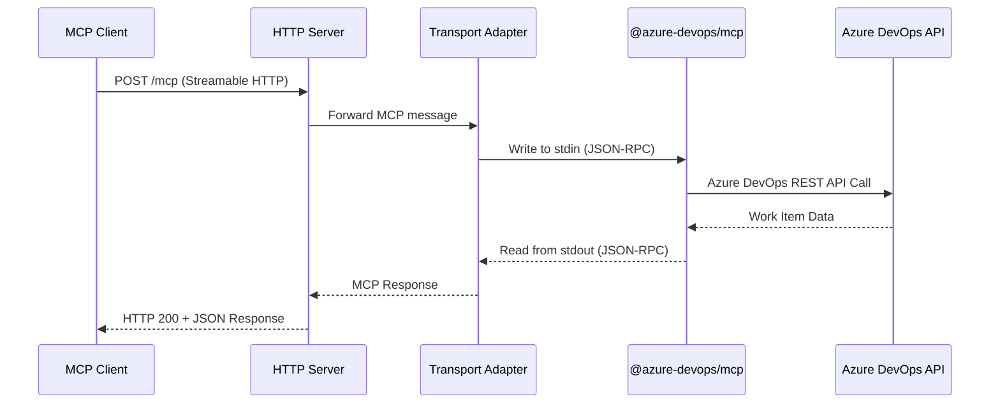

# Azure DevOps MCP HTTP Wrapper - Architecture Document

**Version:** 1.0
**Date:** 2025-01-24
**Focus:** Work Items/Tickets Access Only
**Official MCP Server:** https://github.com/microsoft/azure-devops-mcp

---

## Executive Summary

This document outlines the architecture for a lightweight HTTP wrapper around Microsoft's official Azure DevOps MCP server (`@azure-devops/mcp`). The wrapper adds Streamable HTTP transport capability while maintaining compatibility with the official implementation, enabling remote access to Azure DevOps work items through the Model Context Protocol.

**Key Design Principles:**
- Minimal wrapper layer (proxy/adapter pattern)
- Leverage official Microsoft implementation
- Focus exclusively on work items domain
- Environment-based configuration
- Production-ready Docker packaging
- Single long-running MCP process for simplicity and robustness
- Local use only (127.0.0.1 binding)

---

## Architecture Overview

### Component Diagram

```
┌─────────────────────────────────────────────────────────────────┐
│                         Docker Container                         │
│  ┌───────────────────────────────────────────────────────────┐  │
│  │                    HTTP Wrapper Layer                      │  │
│  │  ┌─────────────────────────────────────────────────────┐  │  │
│  │  │  Node.js Express/Fastify Server                     │  │  │
│  │  │  - Streamable HTTP endpoint (/mcp)                  │  │  │
│  │  │  - Binds to 127.0.0.1 (local only)                  │  │  │
│  │  │  - Request/response translation                     │  │  │
│  │  │  - Health check endpoint (/health)                  │  │  │
│  │  └─────────────────────────────────────────────────────┘  │  │
│  │                          ↕                                 │  │
│  │  ┌─────────────────────────────────────────────────────┐  │  │
│  │  │  Transport Adapter (HTTP ↔ stdio)                   │  │  │
│  │  │  - Single long-running @azure-devops/mcp process   │  │  │
│  │  │  - Manage stdin/stdout pipes                        │  │  │
│  │  │  - Message serialization/deserialization            │  │  │
│  │  │  - Error handling & process restart on failure      │  │  │
│  │  └─────────────────────────────────────────────────────┘  │  │
│  │                          ↕                                 │  │
│  │  ┌─────────────────────────────────────────────────────┐  │  │
│  │  │  @azure-devops/mcp (Official Microsoft Server)      │  │  │
│  │  │  - stdio transport only                             │  │  │
│  │  │  - Domain filter: -d core work work-items          │  │  │
│  │  │  - Azure DevOps API integration                     │  │  │
│  │  │  - Token authentication via ADO_MCP_AUTH_TOKEN env  │  │  │
│  │  └─────────────────────────────────────────────────────┘  │  │
│  └───────────────────────────────────────────────────────────┘  │
│                          ↕                                       │
│              Azure DevOps Services REST API                      │
│              (https://{org}.visualstudio.com)                    │
└─────────────────────────────────────────────────────────────────┘

External Access:
┌──────────────┐
│ MCP Client   │  →  HTTP POST/GET /mcp  →  Wrapper  →  stdio  →  ADO MCP
│ (Claude Code)│  ←  HTTP Response/SSE   ←  Wrapper  ←  stdio  ←  ADO MCP
└──────────────┘
```

### Request Flow



---

## Technology Stack

### Core Components

| Component | Technology | Justification |
|-----------|-----------|---------------|
| **HTTP Server** | Express.js or Fastify | Lightweight, well-documented, excellent stdio process management |
| **Runtime** | Node.js 20 LTS | Required by `@azure-devops/mcp`, LTS support until 2026 |
| **Official MCP** | `@azure-devops/mcp` | Microsoft's official implementation, fully featured |
| **Transport Protocol** | Streamable HTTP | Modern MCP standard (2025-03-26 spec) |
| **Container** | Docker (Alpine-based) | Minimal footprint, production-ready |
| **Process Manager** | Node.js `child_process` | Built-in, reliable stdio pipe management |

### Dependencies

```json
{
  "dependencies": {
    "@azure-devops/mcp": "latest",
    "express": "^4.18.0",
    "body-parser": "^1.20.0",
    "dotenv": "^16.0.0"
  },
  "devDependencies": {
    "typescript": "^5.0.0",
    "@types/node": "^20.0.0",
    "@types/express": "^4.17.0"
  }
}
```

---

## Implementation Approach

### 1. Wrapper Strategy: stdio-to-HTTP Bridge

**Pattern:** Adapter/Proxy Pattern

The wrapper acts as a translation layer between HTTP clients and the stdio-based Azure DevOps MCP server.

**Key Implementation Details:**

```typescript
// server.ts - Core wrapper implementation
import express from 'express';
import { spawn } from 'child_process';

class AdoMcpHttpWrapper {
  private mcpProcess: ChildProcess | null = null;

  constructor(
    private adoOrg: string,
    private adoPat: string
  ) {}

  // Spawn the official MCP server on startup (single long-running process)
  private spawnMcpServer(): ChildProcess {
    return spawn('npx', [
      '-y',
      '@azure-devops/mcp',
      this.adoOrg,
      '-d', 'core', 'work', 'work-items',  // Domain filters
      '--authentication', 'envvar'          // Use environment variable auth
    ], {
      env: {
        ...process.env,
        ADO_MCP_AUTH_TOKEN: this.adoPat  // CORRECT: Official env var name expected from the stdio mcp server
      }
    });
  }

  // Handle HTTP POST /mcp requests
  async handleMcpRequest(req: Request, res: Response): Promise<void> {
    // 1. Ensure MCP process is running (start on first request)
    if (!this.mcpProcess) {
      this.mcpProcess = this.spawnMcpServer();
    }

    // 2. Forward MCP message to stdin
    const mcpMessage = JSON.stringify(req.body) + '\n';
    this.mcpProcess.stdin.write(mcpMessage);

    // 3. Read response from stdout
    const response = await this.readMcpResponse();

    // 4. Return HTTP response
    res.status(200).json(response);
  }

  // Read JSON-RPC response from MCP server stdout
  private async readMcpResponse(): Promise<any> {
    return new Promise((resolve, reject) => {
      const timeout = setTimeout(() => reject(new Error('Timeout')), 30000);

      this.mcpProcess.stdout.once('data', (data) => {
        clearTimeout(timeout);
        try {
          resolve(JSON.parse(data.toString()));
        } catch (err) {
          reject(err);
        }
      });
    });
  }
}
```

### 2. Streamable HTTP Endpoint Implementation

**Endpoint Specification:**

- **POST /mcp** - Client sends MCP requests (JSON-RPC 2.0)
- **GET /mcp** - Server-sent events for streaming (optional, for notifications)
- **GET /health** - Health check endpoint

**Required Headers:**

```
MCP-Protocol-Version: 2025-03-26
Content-Type: application/json
```

### 3. Process Lifecycle

**Single Long-Running Process (Simplified for Local Use)**

- One MCP process spawns on server startup (or first request)
- Process remains running for the entire server lifetime
- All HTTP requests use the same process via stdin/stdout
- Automatic restart on process failure
- Simple and robust for local development/use

### 4. Error Handling

```typescript
// Error handling strategy
class McpErrorHandler {
  static handle(error: Error, res: Response): void {
    if (error.message.includes('ECONNREFUSED')) {
      res.status(502).json({
        error: 'Azure DevOps API unreachable',
        code: 'ADO_API_ERROR'
      });
    } else if (error.message.includes('Timeout')) {
      res.status(504).json({
        error: 'MCP server timeout',
        code: 'TIMEOUT'
      });
    } else if (error.message.includes('authentication')) {
      res.status(401).json({
        error: 'Invalid Azure DevOps PAT',
        code: 'AUTH_ERROR'
      });
    } else {
      res.status(500).json({
        error: 'Internal server error',
        code: 'INTERNAL_ERROR',
        message: error.message
      });
    }
  }
}
```

---

## Docker Configuration

### Dockerfile

```dockerfile
# Multi-stage build for minimal image size
FROM node:20-alpine AS builder

WORKDIR /app

# Copy package files
COPY package*.json ./
COPY tsconfig.json ./

# Install dependencies
RUN npm ci --only=production

# Copy source code
COPY src/ ./src/

# Build TypeScript
RUN npm run build

# Production stage
FROM node:20-alpine

WORKDIR /app

# Copy built artifacts and dependencies
COPY --from=builder /app/node_modules ./node_modules
COPY --from=builder /app/dist ./dist
COPY --from=builder /app/package*.json ./

# Install npx globally for @azure-devops/mcp
RUN npm install -g npx

# Create non-root user
RUN addgroup -g 1001 -S mcp && \
    adduser -S mcp -u 1001

USER mcp

# Expose HTTP port
EXPOSE 8080

# Health check
HEALTHCHECK --interval=30s --timeout=5s --start-period=10s --retries=3 \
  CMD node -e "require('http').get('http://localhost:8080/health', (r) => {process.exit(r.statusCode === 200 ? 0 : 1)})"

# Start server
CMD ["node", "dist/server.js"]
```

### Docker Compose (Local Development)

```yaml
version: '3.8'

services:
  ado-mcp-http:
    build: .
    ports:
      - "127.0.0.1:8080:8080"  # Bind to localhost only
    environment:
      - ADO_ORG=${ADO_ORG}
      - ADO_PAT=${ADO_PAT}
      - MCP_PORT=8080
      - MCP_HOST=127.0.0.1
      - LOG_LEVEL=${LOG_LEVEL:-info}
    restart: unless-stopped
    healthcheck:
      test: ["CMD", "wget", "--no-verbose", "--tries=1", "--spider", "http://localhost:8080/health"]
      interval: 30s
      timeout: 5s
      retries: 3
```

### Build & Run Commands

```bash
# Build image
docker build -t ado-mcp-http-wrapper:latest .

# Run container (local only)
docker run -d \
  --name ado-mcp-http \
  -p 127.0.0.1:8080:8080 \
  -e ADO_ORG="your-org" \
  -e ADO_PAT="your-pat-token" \
  ado-mcp-http-wrapper:latest

# Using docker-compose (recommended)
docker-compose up -d
```

---

## Environment Variable Schema (Simplified for Local Use)

### Required Variables

| Variable | Description | Example |
|----------|-------------|---------|
| `ADO_ORG` | Azure DevOps organization name | `contoso` |
| `ADO_PAT` | Personal Access Token (passed as ADO_MCP_AUTH_TOKEN to MCP server) | `your-pat-token` |

### Optional Variables

| Variable | Description | Default | Example |
|----------|-------------|---------|---------|
| `MCP_PORT` | HTTP server port | `8080` | `3000` |
| `MCP_HOST` | HTTP server bind address | `127.0.0.1` | `127.0.0.1` (local only) |
| `LOG_LEVEL` | Logging verbosity | `info` | `debug`, `warn`, `error` |

### Environment File Template

```bash
# .env.example
# Copy to .env and fill in your values

# Required: Azure DevOps Configuration
ADO_ORG=your-organization-name
ADO_PAT=your-personal-access-token

# Optional: HTTP Server Configuration (defaults are fine for local use)
MCP_PORT=8080
MCP_HOST=127.0.0.1

# Optional: Logging
LOG_LEVEL=info
```

### PAT Permissions Required

The Azure DevOps Personal Access Token must have these scopes:
- **Work Items** - Read
- **Project and Team** - Read

**How to create PAT:**
1. Navigate to Azure DevOps → User Settings → Personal Access Tokens
2. Click "New Token"
3. Set expiration (recommend 90 days with rotation)
4. Select scopes: `Work Items (Read)` and `Project and Team (Read)`
5. Copy token (only shown once)

---

## Project Structure (Simplified)

```
ado-mcp-http-wrapper/
├── src/
│   ├── server.ts              # Main HTTP server & MCP wrapper (all-in-one)
│   ├── config.ts              # Environment configuration loader
│   └── utils/
│       ├── process-manager.ts # MCP process lifecycle management
│       └── error-handler.ts   # Centralized error handling
├── tests/
│   ├── unit/                  # Unit tests
│   └── integration/           # Integration tests
├── Dockerfile                 # Multi-stage Docker image
├── docker-compose.yml         # Local development setup
├── package.json
├── tsconfig.json
├── .env.example               # Environment variable template
├── .dockerignore
├── .gitignore
└── README.md                  # Setup and usage documentation
```

---

## Trade-offs & Recommendations

### Design Trade-offs

| Decision | Pros | Cons | Recommendation |
|----------|------|------|----------------|
| **Wrapper vs Fork** | ✅ Maintain official updates<br>✅ Minimal code maintenance | ❌ Extra layer overhead<br>❌ Limited customization | ✅ **Use Wrapper** - Future-proof |
| **Stateless HTTP** | ✅ Simple scaling<br>✅ No session management | ❌ No streaming state<br>❌ Process startup overhead | ✅ **Use Stateless** - Work items are query-based |
| **Single MCP Process** | ✅ Simple implementation<br>✅ Low resource usage | ❌ Sequential requests<br>❌ Single point of failure | ⚠️ **Consider Process Pool** if >10 req/sec |
| **TypeScript vs JavaScript** | ✅ Type safety<br>✅ Better IDE support | ❌ Build step required<br>❌ Slightly slower dev cycle | ✅ **Use TypeScript** - Better maintainability |
| **Alpine vs Debian** | ✅ 50MB vs 200MB image<br>✅ Faster pulls | ❌ Potential glibc issues<br>❌ Limited debugging tools | ✅ **Use Alpine** - Node.js works well |

### Recommendations

#### 1. **Start Simple, Iterate**
- Begin with stateless, single-process design
- Add process pooling only if performance metrics demand it
- Monitor actual usage patterns before optimization

#### 2. **Basic Logging**
```typescript
// Simple logging for local development
interface LogEntry {
  timestamp: string;
  level: 'info' | 'warn' | 'error';
  component: 'http' | 'adapter' | 'mcp';
  message: string;
  duration_ms?: number;
  error?: Error;
}
```

#### 3. **Local Deployment**

**Development:**
```bash
npm run dev  # Hot reload with nodemon
```

**Docker (Local):**
```bash
docker-compose up
```

#### 4. **Future Enhancements** (If Needed)

**Performance (if scaling required):**
- Process pooling for concurrent requests
- Caching for frequently accessed work items

**Features (if requirements expand):**
- Multi-organization support
- Additional domain filters beyond work items

---

## Risk Assessment

| Risk | Likelihood | Impact | Mitigation |
|------|-----------|--------|------------|
| **Official MCP server breaks stdio contract** | Low | High | Pin to specific version, automated testing |
| **Azure DevOps API rate limiting** | Medium | Medium | Implement request throttling, caching |
| **PAT expiration** | High | High | Monitor expiration, alerting, rotation docs |
| **Memory leaks from long-running MCP process** | Medium | Medium | Process restart policy, memory monitoring |
| **Security: PAT exposure in logs** | Medium | Critical | Sanitize logs, use secret management |

---

## Testing Strategy

### Unit Tests
```typescript
describe('AdoMcpHttpWrapper', () => {
  test('spawns MCP process with correct arguments', () => {
    const wrapper = new AdoMcpHttpWrapper('myorg', 'pat123');
    expect(wrapper.mcpProcess.spawnargs).toContain('-d');
    expect(wrapper.mcpProcess.spawnargs).toContain('core');
    expect(wrapper.mcpProcess.spawnargs).toContain('work');
    expect(wrapper.mcpProcess.spawnargs).toContain('work-items');
    expect(wrapper.mcpProcess.spawnargs).toContain('--authentication');
    expect(wrapper.mcpProcess.spawnargs).toContain('envvar');
  });

  test('sets ADO_MCP_AUTH_TOKEN environment variable', () => {
    const wrapper = new AdoMcpHttpWrapper('myorg', 'pat123');
    expect(wrapper.mcpProcess.env.ADO_MCP_AUTH_TOKEN).toBe('pat123');
  });
});
```

### Integration Tests
```typescript
describe('End-to-End MCP Request', () => {
  test('fetches work items from Azure DevOps', async () => {
    const response = await fetch('http://localhost:8080/mcp', {
      method: 'POST',
      headers: {
        'Content-Type': 'application/json',
        'MCP-Protocol-Version': '2025-03-26'
      },
      body: JSON.stringify({
        jsonrpc: '2.0',
        method: 'tools/call',
        params: {
          name: 'list_work_items',
          arguments: { project: 'MyProject' }
        },
        id: 1
      })
    });

    expect(response.status).toBe(200);
    const data = await response.json();
    expect(data.result).toHaveProperty('workItems');
  });
});
```

---

## Success Metrics

**Development Success:**
- ✅ All tests passing (>80% coverage)
- ✅ Docker image builds successfully
- ✅ Can query work items from Azure DevOps via HTTP
- ✅ Response time <2 seconds for simple queries
- ✅ Zero security vulnerabilities in dependencies

**Production Readiness:**
- ✅ Health check returns 200 OK
- ✅ Handles 50 concurrent requests without errors
- ✅ Graceful error handling for all known failure modes
- ✅ Comprehensive logging with request tracing
- ✅ Documentation complete (README, API docs, deployment guide)

---

## Conclusion

This architecture provides a **simple, robust solution** for adding HTTP transport to Microsoft's official Azure DevOps MCP server for **local use only**. The wrapper approach ensures:

1. **Future-proof:** Automatically benefits from Microsoft's updates
2. **Simple:** Minimal code surface area, single long-running process
3. **Robust:** Automatic process restart on failure, proper error handling
4. **Secure for local use:** Binds to 127.0.0.1, PAT properly passed to MCP server
5. **Focused:** Work items domain only (clear scope, fast delivery)

**Key Simplifications for Local Use:**
- No origin validation (127.0.0.1 binding provides security)
- No rate limiting or advanced security features
- No Kubernetes/cloud deployment complexity
- Single long-running MCP process (no pooling needed)
- Minimal environment variables

**Correct Implementation Details:**
- Environment variable: `ADO_MCP_AUTH_TOKEN` (not `AZURE_DEVOPS_PAT`)
- Authentication flag: `--authentication envvar` required
- Domain filters: `-d core work work-items`

This solution provides exactly what's needed for a local HTTP wrapper - nothing more, nothing less.
